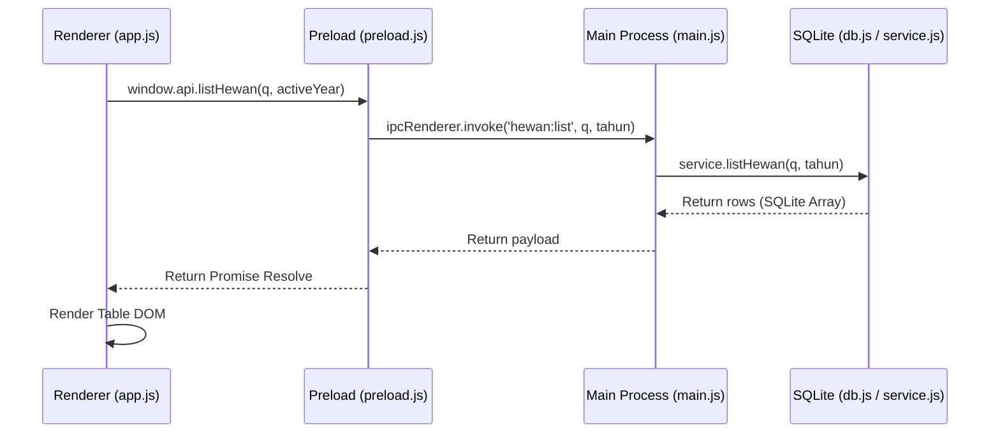
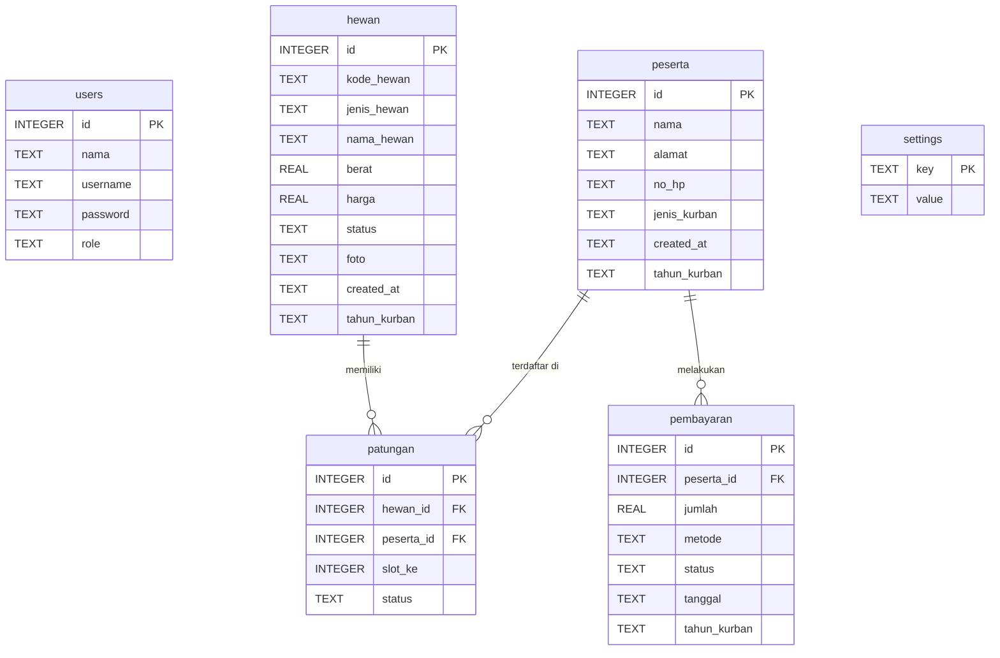

# 🐂 Wiki Panduan Lengkap QurbanApp

Selamat datang di Wiki Panduan Resmi **QurbanApp** — Aplikasi Desktop Pendataan Kurban Luring (Offline-first). Dokumen ini dirancang untuk memberikan pemahaman menyeluruh tentang arsitektur sistem, struktur data, fungsionalitas bagi pengguna akhir (panitia), serta instruksi teknis bagi pengembang (developer) yang ingin memodifikasi atau mengembangkan aplikasi ini lebih lanjut.

---

## Daftar Isi
1. [Pendahuluan & Gambaran Umum](#1-pendahuluan--gambaran-umum)
2. [Arsitektur & Alur Kerja Sistem](#2-arsitektur--alur-kerja-sistem)
3. [Panduan Pengguna (User Manual)](#3-panduan-pengguna-user-manual)
4. [Panduan Pengembangan (Developer Guide)](#4-panduan-pengembangan-developer-guide)
5. [Penyelesaian Masalah & FAQ (Troubleshooting)](#5-penyelesaian-masalah--faq-troubleshooting)

---

## 1. Pendahuluan & Gambaran Umum
**QurbanApp** adalah solusi desktop yang dibangun khusus untuk memudahkan panitia kurban dalam mencatat data hewan kurban, peserta kurban, patungan sapi, cicilan pembayaran, hingga mencetak kuitansi dan ekspor laporan secara instan tanpa memerlukan koneksi internet.

### Karakteristik Utama:
*   **Offline-first**: Seluruh data disimpan secara lokal menggunakan database SQLite. Aplikasi dapat berjalan 100% tanpa internet.
*   **Keamanan Terjamin**: Sesi pengguna dilindungi dari akses tidak sah dengan pengaman idle timeout dan enkripsi sandi satu arah.
*   **Dokumen Profesional**: Dilengkapi dengan mesin pembuat kuitansi PDF otomatis berukuran A5 dengan nominal rupiah terbilang otomatis, serta ekspor rekap ke format Excel.

---

## 2. Arsitektur & Alur Kerja Sistem

### A. Pola Interaksi IPC (Inter-Process Communication)
Sebagai aplikasi Electron, QurbanApp terbagi menjadi dua proses utama:
1.  **Main Process ([main.js](file:///c:/xampp/htdocs/QurbanApp/main.js))**: Mengelola siklus hidup jendela aplikasi, akses sistem operasi (file system, dialog box, shell), dan eksekusi query langsung ke database.
2.  **Renderer Process ([app.js](file:///c:/xampp/htdocs/QurbanApp/src/js/app.js))**: Mengatur antarmuka pengguna (UI), menangani input/klik, serta meminta data dari Main Process melalui perantara [preload.js](file:///c:/xampp/htdocs/QurbanApp/preload.js).

Setiap query pemuatan data disesuaikan untuk meneruskan parameter `tahun_kurban` agar data terarsip secara bersih berdasarkan tahun aktif yang dipilih pengguna.



### B. Keamanan & Sesi Pengguna
Sistem autentikasi dikelola dengan alur kerja berikut:
*   **Enkripsi Kata Sandi**: Kata sandi disimpan dengan format `scrypt$salt$hash`. Setiap sandi di-hash menggunakan fungsi `crypto.scryptSync` dengan tambahan *salt* unik sepanjang 16 byte.
*   **Verifikasi Sandi**: Proses pencocokan sandi menggunakan fungsi `crypto.timingSafeEqual` di dalam [service.js](file:///c:/xampp/htdocs/QurbanApp/src/database/service.js#L52-L57) untuk melindungi aplikasi dari serangan *timing attack*.
*   **Penyaringan Keamanan IPC**: Fungsi modifikasi database (create, update, delete) dibungkus menggunakan helper `secureHandle` di dalam [main.js](file:///c:/xampp/htdocs/QurbanApp/main.js#L100-L109). Fungsi ini mencocokkan ID pengirim event IPC dengan map sesi aktif `authSessions` di memori utama. Jika tidak cocok (misal pengguna belum login atau sesi kedaluwarsa), aksi ditolak.
*   **Idle Session Timeout**: Sistem memantau event `click`, `keydown`, dan `mousemove` pada aplikasi. Jika pengguna tidak melakukan aktivitas apa pun selama **30 menit**, pengaman di [app.js](file:///c:/xampp/htdocs/QurbanApp/src/js/app.js#L103-L115) akan otomatis menghapus sesi lokal dan memaksa aplikasi memuat ulang ke halaman login.

### C. Skema Database SQLite
Database disimpan pada direktori profil pengguna yang aman untuk penulisan (*writable*).
*   **Windows**: `%APPDATA%/QurbanApp/qurbanapp.db`
*   **Linux/MacOS**: `~/.config/QurbanApp/qurbanapp.db`

Tabel utama `hewan`, `peserta`, dan `pembayaran` dilengkapi dengan kolom `tahun_kurban` agar mendukung pengarsipan data multi-tahun.

#### Diagram Hubungan Tabel (ERD):


---

## 3. Panduan Pengguna (User Manual)

### A. Login Pertama Kali
Saat aplikasi dijalankan pertama kali, gunakan kredensial bawaan berikut untuk masuk:
*   **Username**: `admin`
*   **Password**: `admin`

> [!IMPORTANT]
> Segera ganti kata sandi bawaan ini melalui menu **Pengaturan > Ganti Password** untuk menjaga keamanan data kurban Anda.

### B. Dashboard & Pemisahan Tahun Aktif
*   **Dropdown Tahun Kurban**: Terletak pada bagian navbar atas di samping info sesi login. Anda dapat beralih tahun kurban aktif (misalnya `1447 H / 2026 M` ke `1448 H / 2027 M`). Seluruh data yang tersaji di dashboard, tabel hewan, peserta, patungan, pembayaran, dan laporan akan otomatis berubah mengikuti filter tahun kurban yang terpilih.
*   **Kartu Statistik**: Menampilkan ringkasan data tahun berjalan secara *realtime* (total hewan, peserta terdaftar, dana pembayaran terkumpul, dan jumlah hewan disembelih).
*   **Grafik Lingkaran**: Menyajikan grafik perbandingan jumlah sapi dan kambing berbasis *Chart.js*.

### C. Pengelolaan Data Hewan Kurban
*   **Tambah Hewan**: Klik tombol "Tambah Hewan", isi jenis hewan (Sapi/Kambing), nama/tipe, berat, harga beli, status awal, dan unggah foto fisik jika ada. Hewan akan tersimpan pada tahun kurban yang aktif.
*   **Foto Hewan**: File foto dikompresi ke Base64, lalu disalin otomatis ke `%APPDATA%/QurbanApp/uploads/` agar database SQLite tetap berukuran ringan.
*   **Format Rupiah & Terbilang Otomatis**: Pratonton nominal rupiah terformat beserta ejaan kata terbilang langsung tersaji di bawah kolom input harga kurban.

### D. Pendaftaran Peserta Kurban & Impor Excel
*   **Input Manual**: Masukkan nama lengkap, alamat, nomor telepon aktif, dan jenis kurban.
*   **Fitur Slot Patungan Langsung (Dinamis)**: Jika jenis kurban **Patungan Sapi** dipilih pada saat pendaftaran peserta baru, modal pendaftaran akan menampilkan pilihan sapi kurban aktif dan pilihan nomor slot (1-7) yang masih kosong secara otomatis. Ini mempersingkat pengisian tanpa perlu masuk ke menu Patungan Sapi secara terpisah.
*   **Impor Massal via Excel**: Klik tombol **Template Excel** untuk mengunduh kerangka kolom. Isi data warga peserta kurban pada berkas Excel tersebut, lalu klik **Impor Excel** untuk memasukkan data secara massal ke dalam tahun kurban aktif.

### E. Modul Patungan Sapi
Modul ini digunakan untuk melacak detail patungan sapi (maksimal 7 slot):
*   Sistem menolak pengisian slot ganda pada nomor slot yang sama.
*   Sistem mencegah satu peserta terdaftar lebih dari sekali pada sapi kurban yang sama.
*   Tampilan kartu grid visual memudahkan panitia memantau sapi mana saja yang slotnya masih kosong atau terisi penuh.

### F. Input Pembayaran & Bukti Kirim/Salin WhatsApp
*   **Input Pembayaran**: Pilih peserta kurban, masukkan nominal pembayaran (Rp), pilih metode (`cash` atau `transfer`), status (`lunas` atau `belum lunas`).
*   **Cetak Kuitansi Resmi (A5)**: Klik tombol **Kwitansi** pada tabel untuk mengunduh bukti PDF resmi format A5.
*   **Kirim via WhatsApp**: Klik tombol **Kirim WA** untuk membuka link browser API WhatsApp otomatis ke nomor peserta.
*   **Salin Teks WA**: Klik tombol **Salin** untuk langsung menyalin draf teks bukti bayar ke clipboard komputer. Panitia cukup membuka WhatsApp Desktop dan menempelkannya (*paste* / `Ctrl+V`) tanpa perlu membuka tab baru di web browser.

### G. Laporan & Ekspor
*   **Penyaringan**: Saring data berdasarkan rentang tanggal tertentu pada tahun kurban aktif.
*   **Ekspor Excel**: Klik **Export Excel**, pilih jenis data laporan yang ingin diekspor (Hewan, Peserta, atau Pembayaran) ke format `.xlsx`.
*   **Ekspor PDF Rekapitulasi**: Klik **Export PDF** untuk menyusun rangkuman tabel gabungan dalam dokumen PDF.
*   **Print**: Klik **Print** untuk memicu kotak dialog cetak printer fisik di komputer Anda.

### H. Pengaturan Organisasi & Kelola Daftar Tahun
*   **Kop Kuitansi**: Ubah nama masjid/organisasi serta alamat/kontak pada form Profil Organisasi.
*   **Kelola Daftar Tahun**: Di dalam menu Pengaturan, Anda dapat mengedit daftar tahun kurban (dipisahkan dengan koma) untuk menambah tahun baru (misal: `1448 H / 2027 M, 1449 H / 2028 M`).
*   **Backup & Restore**: Lakukan ekspor database `.db` ke flashdisk secara manual, atau lakukan restore berkas database lama.

---

## 4. Panduan Pengembangan (Developer Guide)

### A. Prasyarat Lingkungan Pengembangan
*   [Node.js](https://nodejs.org/) (v20 ke atas)
*   [Git](https://git-scm.com/)
*   **C++ Build Tools**: Diperlukan untuk kompilasi modul native SQLite `better-sqlite3`. Buka PowerShell administrator dan jalankan: `npm install --global windows-build-tools` (atau pasang Visual Studio C++ build tools).

### B. Instalasi & Menjalankan Proyek
1. Clone repositori: `git clone https://github.com/Nuno-Hadianto/QurbanApp.git`
2. Pasang dependensi: `npm install`
3. Jalankan mode pengembangan: `npm start`

### C. Alur Komunikasi IPC (Meneruskan Parameter Tahun)
1.  **Service Layer ([service.js](file:///c:/xampp/htdocs/QurbanApp/src/database/service.js))**:
    ```javascript
    function listHewan(q = '', tahun) {
      return db.prepare("SELECT * FROM hewan WHERE (kode_hewan LIKE ? OR nama_hewan LIKE ?) AND tahun_kurban = ?").all(`%${q}%`, `%${q}%`, tahun);
    }
    ```
2.  **IPC Handler ([main.js](file:///c:/xampp/htdocs/QurbanApp/main.js))**:
    ```javascript
    ipcMain.handle('hewan:list', async (_, q, tahun) => service.listHewan(q, tahun));
    ```
3.  **Preload Bridge ([preload.js](file:///c:/xampp/htdocs/QurbanApp/preload.js))**:
    ```javascript
    listHewan: (q, tahun) => ipcRenderer.invoke('hewan:list', q, tahun),
    ```
4.  **Frontend ([app.js](file:///c:/xampp/htdocs/QurbanApp/src/js/app.js))**:
    ```javascript
    state.hewan = await window.api.listHewan(q, activeYear);
    ```

### D. Mengompilasi dan Membuat Installer (.EXE)
*   Hapus folder build dist lama: `npm run clean`
*   Lakukan kompilasi pembuatan installer baru: `npm run build`
*   Installer tersimpan di folder `dist/` dengan nama berkas **`QurbanAppSetup.exe`**.

---

## 5. Penyelesaian Masalah & FAQ (Troubleshooting)

### Q: Mengapa `npm install` gagal pada dependensi `better-sqlite3`?
**A**: Pastikan C++ compiler terpasang di komputer Anda. Jalankan perintah `npm install --global windows-build-tools` melalui PowerShell Administrator atau install Visual Studio Build Tools.

### Q: Mengapa setelah melakukan Restore Database, data saya belum langsung berubah?
**A**: Proses pemulihan memerlukan pembersihan file log WAL aktif agar tidak korup. Aplikasi akan otomatis menutup diri dan menjadwalkan restorasi berkas saat aplikasi dibuka kembali (*relaunch*).

### Q: Bagaimana cara manual merestorasi database jika file rusak?
**A**: Matikan semua proses Electron `QurbanApp` di Task Manager. Pergi ke folder `%APPDATA%/QurbanApp/` dan hapus file `qurbanapp.db-wal` serta `qurbanapp.db-shm`. Setelah itu, salin file database cadangan Anda dan ganti namanya menjadi `qurbanapp.db` (menimpa file lama). Buka kembali aplikasi.
